<!-- ===== Header banner ===== -->

<!-- ===== Typing animation ===== -->

  

<!-- ===== Contact badges ===== -->

## About Me

AI/ML Engineer (**GIKI '26**) focused on shipping AI systems that make it out of the notebook — into APIs, products, and real users' hands.

- Built **Dhayan** — a multimodal humanoid robot for autistic support, running on **Jetson Orin Nano** (final-year project)
- At **PITB**: shipped a Sentinel-2 soil-moisture segmentation pipeline (**UNet, 0.89 mIoU**) and a hybrid-search RAG chatbot serving citizens through *Maryam Ki Dastak*
- At **Nayatel**: built an enterprise RAG support chatbot — **92% precision**, 1,000+ daily queries in production
- Winner — **All Pakistan Prompt Engineering Competition 2025**
- Published at **ICAI 2024** (Varna, Bulgaria) — CNN-based malaria cell classification, **96% accuracy**

## Featured Projects

| Project | What it does | Stack |
|---|---|---|
| [**Dhayan — Humanoid Robot for Autistic Support**](https://github.com/Qasimali20/Dhayan-FYP) | Multimodal assistive framework optimized for custom robotic hardware runtimes | `Jetson Orin Nano` `Python` `OpenCV` `SpeechRecognition` |
| [**Urdu Audio Deepfake Detection**](https://github.com/Qasimali20/Urdu-Audio-Deepfake) | Detects adversarial voice-cloning variants in a low-resource language | `CNN` `LSTM` `MFCC` `Mel-spectrograms` |
| [**AI-Powered PCOS Assistant**](https://github.com/Qasimali20/AI-PCOS) | Multimodal clinical support — imaging diagnostics + symptom intake → insights | `ResNet50` `Grad-CAM` `LangChain` `n8n` |
| [**Cotton Detection & Yield Prediction**](https://github.com/Qasimali20/Cotton-Detection) | Precision-agriculture vision for rapid multi-instance counting from field imagery | `YOLOv12` `PyTorch` `Computer Vision` |

### Industry Work

- **Hybrid Search RAG Chatbot** · BM25 + Milvus + bge embeddings on Qwen3-8B-AWQ via vLLM, with hallucination guardrails and reranking → **+22% retrieval accuracy, −30% irrelevant responses**
- **Satellite Soil-Moisture Segmentation** · UNet on 13-band Sentinel-2 multispectral imagery, experiment tracking with MLflow → **0.89 mean IoU**
- **Customer Support Chatbot** · LangChain RAG + LLaMA3-8B, containerized with Flask, ReactJS & Docker → **92% precision, 1,000+ queries/day**

## Tech Stack

**ML / Deep Learning**

**LLM & Agentic Systems**

**Backend, MLOps & Edge**

## Achievements & Research

- **1st Place** — All Pakistan Prompt Engineering Competition (2025)
- **International Hackathons** — Co-Creating with GPT-5 (LabLab.ai), ElevenLabs Voice AI, Llama 2 × Clarifai
- **Publication** — *Malaria Cell Classification Using CNN: A Deep Learning Approach* · ICAI 2024, Varna, Bulgaria

## GitHub Stats

<!--
  Stats + top-language cards are static SVGs, regenerated daily by
  .github/workflows/update-github-stats.yml and committed to assets/.
  They render straight from this repo, so they never rate-limit or go down.
  To re-theme, edit the "options" lines in that workflow.
  (The streak card below is still served live by streak-stats.demolab.com.)
-->

  
  

  

## Get in Touch

Have an AI problem worth solving? Let's talk.

**alimqasim427@gmail.com** · [mqa-portfolio.vercel.app](https://mqa-portfolio.vercel.app/) · [LinkedIn](https://www.linkedin.com/in/muhammad-qasim-ali-ai/)

